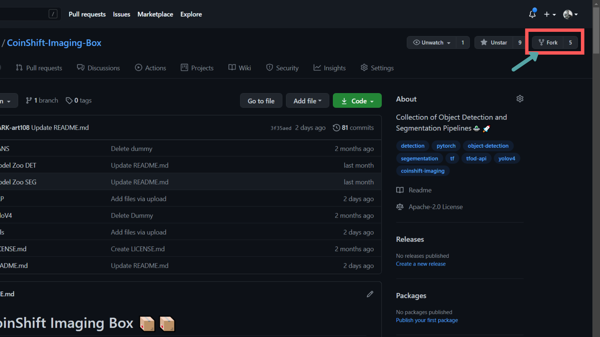

## How to Contribute
 This is an Open Source project and we would be happy to see contributors who report bugs and file feature requests submitting pull requests as well.
 This project adheres to the Contributor Covenant code of conduct.
 By participating, you are expected to uphold this code style.
 Please report issues here [Issues - CoinShift-Imaging/CoinShift-Imaging-Box](https://github.com/CoinShift-Imaging/CoinShift-Imaging-Box/issues)

### Branch Policy

#### Sending pull requests:

Go to the repository on GitHub at https://github.com/CoinShift-Imaging/CoinShift-Imaging-Box.

Click the “Fork” button at the top right.

  

You’ll now have your copy of the original CoinShift-Imaging-Box repository in your GitHub account.

Open a terminal/shell.

Type

`$ git clone https://github.com/CoinShift-Imaging/CoinShift-Imaging-Box`

where 'username' is your username.

You’ll now have a local copy of your version of the original CoinShift-Imaging-Box repository.

#### Change into that project directory (CoinShift-Imaging-Box):

`$ cd CoinShift-Imaging-Box`

#### Add a connection to the original owner’s repository.

`$ git remote add upstream https://github.com/CoinShift-Imaging/CoinShift-Imaging-Box`

#### To check this remote add set up:

`$ git remote -v`

#### Make changes to files.

`git add` and `git commit` those changes

`git push` them back to GitHub. These will go to your version of the repository.

#### Squashing your's changes
Before you make Pull Request, you should squash your commits into one.

Go into the directory for the project and type:

`git checkout my_branch`
`git reset --soft HEAD~Number`
`git commit`
`git push --force origin my_branch`

where 'Number' is the number of commits to squash and 'my_branch 'is your branch name.

This will squash your commits into one single commit.

Now push them and Create A PR.

#### Now Create a PR (Pull Request)
Go to your version of the repository on GitHub.

Click the “New pull request” button at the top.

Note that CoinShift-Imaging-Box repository will be on the left and your repository will be on the right.

Click the green button “Create pull request”. Give a succinct and informative title, in the comment field give a short explanation of the changes and click the green button “Create pull request” again.

**Best Practices**: Create a seperate Branch for Raising PR's to maintain a clean workflow.

#### Pulling others’ changes
Before you make further changes to the repository, you should check that your version is up to date relative to CoinShift-Imaging-Box version.

Go into the directory for the project and type:

`$ git checkout master`
`$ git pull upstream master --rebase`

This will pull down and merge all of the changes that have been made in the original CoinShift-Imaging-Box original repository.

Now push them back to your Github repository.

`$ git push origin master`

### Proposing Your Idea's

We are always open to great ideas and suggestion's, for discussing your ideas and issues you want to raise, first propose it to the Discussion forums of Github,head towards https://github.com/CoinShift-Imaging/CoinShift-Imaging-Box/discussions
