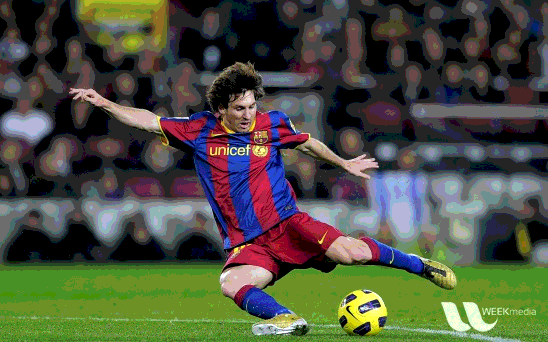

# GrabCut Algorithm

GrabCut is any technique which allows an image’s background to be removed or foreground to be extracted for further processing like object recognition, tracking, etc.

## How it works

1. In this algorithm, a region is drawn according to the foreground required.
2. A rectangle is drawn over over the region which encases the main object. 
3. The region coordinates are decided over understanding the foreground mask and segmentation can be done more accurately by manual coordinate selection.
4. This technique functions similar to a green screen in cinematics.

 

### Input image:

</a>

### Output image:

</a>
