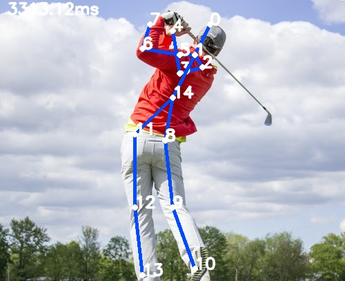

# Pose Detection using OpenCv

Make sure to download the pretained models.  
This can be done by running getModels.sh file.

The required files will be downloaded inside the folder in a file named *pose*.

There are three pretrained models available each trained on a different dataset (MPI, BOdy_25, COCO).  
This code implements with the help of MPI dataset.
  

## How to run:

1. Set up on your local machine.
2. Download the pretained models (MPI here) by running getModels.sh file.
3. The required files (.caffemodel and .protxtx) will be downloaded inside the folder in a folder *./pose/mpi/_*.

4. To Run MPI pretrained model on an image `sample.jpg`

    run on terminal-

    `python3 pose_estimation.py --input sample.jpg --proto pose/mpi/_/pose_deploy_linevec.prototxt --model pose/mpi/_/pose_iter_160000.caffemodel`

 

The output results are shown in a new image `result_sample.jpg` saved inside the same folder along with the sample image.
  

# Output

## Sample Image:

## Output Image:

